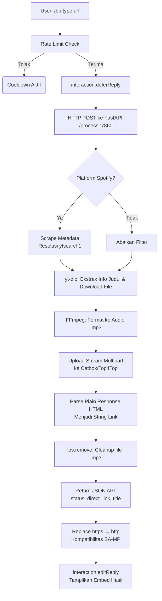

# BotJS URL Generator 🎵

Discord bot dengan arsitektur **Microservices** yang mengonversi link audio/video menjadi **direct link MP3**. Bot ini mendukung ekstraksi metadata secara dinamis, command bantuan interaktif, pemantauan server, dan secara otomatis melakukan registrasi *slash commands* secara pintar (Smart Auto-Register).

---

## 🗂️ Struktur Proyek

```text
BotJS-url-generate/
├── frontend/               ← Node.js (Discord Bot)
│   ├── index.js            ← Entry point + command handler + Smart Auto-Register
│   ├── package.json
│   └── .env.example        ← Template konfigurasi
│   └── commands/
│       ├── bb.js           ← Command /bb (konversi URL)
│       ├── search.js       ← Command /search (cari lagu by judul)
│       ├── help.js         ← Command /help
│       └── server.js       ← Command /server (status server)
│
├── backend/                ← Python FastAPI
│   ├── api.py              ← REST API + yt-dlp (ekstrak judul & file) + uploader
│   ├── requirements.txt
│   └── downloads/          ← Folder sementara (auto-dibuat, auto-dibersihkan)
│
├── Dockerfile              ← 🐳 Deploy ke Hugging Face Spaces (Docker)
├── start.sh                ← Script entrypoint Docker (backend + frontend)
├── run-server.bat          ← 🚀 Jalankan semua sekaligus (Windows)
└── .gitignore
```

---

## ⚙️ Prasyarat

| Perangkat Lunak | Versi Minimum | Link Download |
|---|---|---|
| **Node.js** | 18.x LTS | https://nodejs.org |
| **Python** | 3.10+ | https://python.org |
| **FFmpeg** | Any | https://ffmpeg.org/download.html |

> **FFmpeg wajib ada di `PATH`** agar yt-dlp dapat mengonversi ke MP3.

---

## 🚀 Cara Menjalankan

### ▶️ Lokal (Windows)

#### Langkah 1 – Konfigurasi `.env`

```bash
cd frontend
copy .env.example .env
# Lalu edit .env dengan text editor
```

Isi file `frontend/.env`:
```env
BOT_TOKEN=TOKEN_BOT_DISCORD_KAMU
CLIENT_ID=CLIENT_ID_APLIKASI_DISCORD_KAMU
```

#### Langkah 2 – Jalankan semua server

Cukup **double-click** `run-server.bat`.

Script akan otomatis:
1. ✅ Mengecek Python, Node.js, dan FFmpeg
2. 📦 Install semua dependencies Python & Node.js
3. 🔄 Membuka 2 jendela CMD terpisah:
   - **Jendela 1**: FastAPI backend di `http://127.0.0.1:7860`
   - **Jendela 2**: Discord Bot (Node.js)

> 💡 **Smart Auto-Register**: Saat bot Discord dihidupkan, fitur Smart Auto-Register akan mengecek ukuran dan nama command yang aktif di Discord. Apabila ada perintah baru atau ada yang berubah, bot otomatis mendaftarkannya, mencegah pemborosan request API Discord jika perintah sudah identik (up-to-date).

---

### 🐳 Deploy ke Hugging Face Spaces (Docker)

Proyek ini siap di-deploy ke **Hugging Face Spaces** menggunakan Docker environment.

#### Langkah 1 – Buat Space baru di Hugging Face

1. Buka https://huggingface.co/spaces
2. Klik **Create new Space**
3. Pilih SDK: **Docker**
4. Beri nama Space, set visibility sesuai kebutuhan

#### Langkah 2 – Set Repository Secrets

Di halaman Space kamu → **Settings → Repository Secrets**, tambahkan:

| Secret Name | Nilai |
|---|---|
| `BOT_TOKEN` | Token bot Discord kamu |
| `CLIENT_ID` | Application ID Discord kamu |

> ⚠️ **Jangan pernah push file `.env` ke repository!** Selalu gunakan Secrets HF untuk menyimpan credential.

#### Langkah 3 – Push ke repository HF Space

```bash
git remote add hf https://huggingface.co/spaces/USERNAME/NAMA-SPACE
git push hf main
```

Hugging Face akan otomatis build Docker image dari `Dockerfile` yang ada di root proyek dan menjalankan `start.sh`.

#### Catatan Deployment Docker

- Backend FastAPI berjalan di port **7860** (port wajib HF Spaces)
- Frontend Node.js Discord Bot berjalan di foreground sebagai proses utama
- `start.sh` menjalankan backend di background (`&`) dan frontend di foreground
- Semua environment variables harus diset lewat HF Secrets, bukan file `.env`

---

## 🤖 Cara Pakai di Discord

BotJS menyediakan beberapa *slash commands* yang bisa kamu gunakan:

### 1. `/bb` (Konversi URL ke MP3)
Mengubah link audio/video menjadi *direct link* MP3 lengkap beserta detail informasinya.
```text
/bb type:youtube    url:https://www.youtube.com/watch?v=...
/bb type:tiktok     url:https://www.tiktok.com/@.../video/...
/bb type:soundcloud url:https://soundcloud.com/artist/track
/bb type:spotify    url:https://open.spotify.com/track/...
```
Bot akan membalas dengan **Embed** cantik yang menampilkan Judul Lagu/Video, Platform asal, hingga link unduhan langsung yang sudah diformat dengan *code block* (mudah di-copy) menggunakan protokol `http://` (kompatibel SA-MP audio stream).

### 2. `/search` (Cari Lagu by Judul)
Mencari dan mengonversi lagu berdasarkan **nama judul** tanpa perlu URL, langsung ke direct link MP3.
```text
/search query:Shape of You Ed Sheeran
/search query:Bohemian Rhapsody Queen
```

### 3. `/help` (Panduan Bantuan)
Menampilkan sebuah interaksi Embed berisi ringkasan perintah apa saja yang bisa digunakan dan panduan fungsi dasar bot.

### 4. `/server` (Status Kinerja Server)
Melihat data kondisi *real-time* sistem di belakang bot, menampilkan:
- Latensi (Ping) koneksi bot (ms).
- Beban CPU sistem.
- Pemakaian RAM perangkat / alokasi total.
- Detail *Owner* (The Kims 1975).
- Timestamp / Waktu server zona lokal.

---

## 🛡️ Rate Limiter

| Parameter | Nilai |
|---|---|
| **Basis** | Per Channel ID |
| **Maksimum** | 5 eksekusi |
| **Window** | 35 detik |

Rate limit hanya berlaku bagi fungsi konversi utama (`/bb`). Jika limit tercapai, bot memberikan pesan peringatan kooldown yang sifatnya *ephemeral* (hanya terlihat oleh pengirim).

---

## 🔄 Alur Kerja (Pipeline)



---

## 🌐 API Endpoints

| Method | Route | Deskripsi |
|---|---|---|
| `POST` | `/process` | Memproses URL → Ekstrak Title → Upload → Output Direct Link |
| `GET` | `/health` | Health check koneksi Backend FastAPI |
| `GET` | `/docs` | OpenAPI / Swagger UI Dokumentasi |
| `GET` | `/redoc` | ReDoc Dokumentasi |

### Request Body `/process`
```json
{
  "type": "youtube | tiktok | soundcloud | spotify | search",
  "url": "https://... atau judul lagu (untuk type search)"
}
```

### Response Sukses
```json
{
  "status": "success",
  "direct_link": "http://files.catbox.moe/xxxxxx.mp3",
  "title": "Nama Artis - Judul Lagu Official Video"
}
```

> 💡 `direct_link` selalu menggunakan protokol `http://` (bukan `https://`) untuk kompatibilitas SA-MP audio stream.

### Response Error
```json
{
  "status": "error",
  "message": "Detail pesan error traceback..."
}
```

---

## 🛠️ Konfigurasi Discord Developer Portal

1. Buka https://discord.com/developers/applications
2. Buat aplikasi baru (atau gunakan yang sudah ada)
3. Di tab **Bot**: aktifkan bot, salin **Token**
4. Di tab **General Information**: salin **Application ID** (CLIENT_ID)
5. Di tab **OAuth2 → URL Generator**:
   - Scopes: `bot`, `applications.commands`
   - Bot Permissions: `Send Messages`, `Use Slash Commands`, `Embed Links`
6. Gunakan URL yang dihasilkan untuk invite bot ke server kamu

---

## 📝 Lisensi

MIT License
